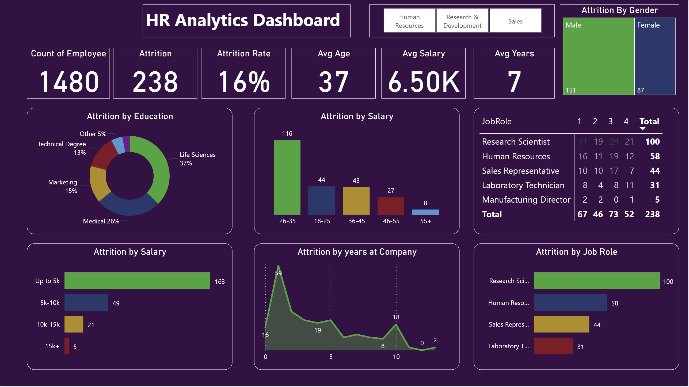

# HR Analytics Dashboard – Power BI

An interactive HR analytics dashboard built in Power BI to visualize and analyze employee attrition data. The project aims to identify key factors contributing to employee turnover and provide insights for HR strategy.

## 📊 Key Features
- Summary KPIs: Total Employees, Attrition Rate, Avg Age, Salary, and Tenure
- Attrition Breakdown by:
  - Age Groups
  - Salary Ranges
  - Job Roles & Departments
  - Education Fields
  - Gender & Years at Company
- Interactive visuals with slicers and filters for dynamic exploration

## 🛠️ Tools & Skills
- **Power BI** (Power Query, DAX, Slicers, Custom Visuals)
- **Excel** for data pre-processing
- Data cleaning, KPI creation, and drill-down analysis

## 📂 Files
- `Final_Project.pbix`: Power BI dashboard file
- `HR_Data.xlsx`: Raw dataset used for analysis
- `images/dashboard-preview.jpg`: Snapshot of the dashboard layout

## 🔍 Key Insights
- Employees earning less than $5K had the highest attrition rate.
- The 26–35 age group showed the most turnover.
- Research Scientists had the highest attrition by job role.
- Most employees left within the first year of employment.

## 🖼️ Dashboard Preview

